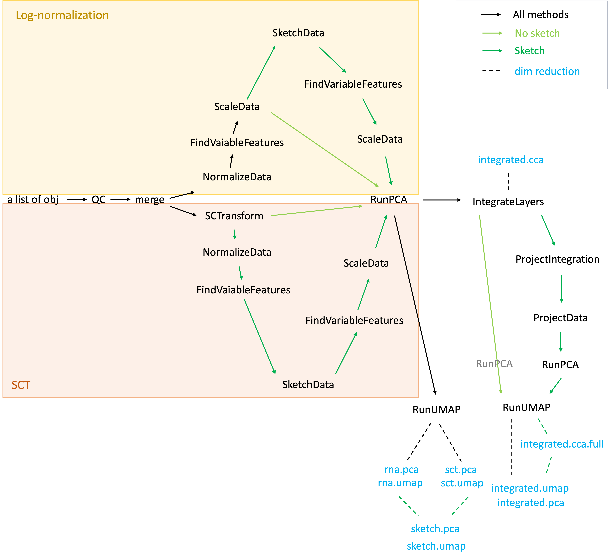

# seurat-v5-demo

This workflow is aimed at demonstrating snRNA-seq analysis using Seurat v5 
with various combinations for normalization, integration, and [sketching]
(https://www.sciencedirect.com/science/article/pii/S2405471219301528). 
Sketching was introduced to [Seurat v5](https://satijalab.org/seurat/) to enhance
memory usage when analyzing large datasets.

Refer to the following repository of mine if you are interested in more 
polished workflow:

- [multiome-wf GitHub](https://github.com/NICHD-BSPC/multiome-wf)
- [multiome-wf Documentation](https://nichd-bspc.github.io/multiome-wf/)

## Scripts

```
$ tree
.
├── README.md
├── sampletable.tsv
└── scripts
    ├── seurat-v5-qc-lognorm-sketch.Rmd
    ├── seurat-v5-qc-lognorm-unsketch.Rmd
    ├── seurat-v5-qc-nosketch.Rmd
    ├── seurat-v5-qc-sct-sketch.Rmd
    ├── seurat-v5-qc-sct-unsketch.Rmd
    ├── seurat-v5-qc-sketch-lognormonly.Rmd
    └── seurat-v5-qc-sketch.Rmd
```

- `sampletable.tsv`: sampletable pointing to input `h5` files generated by 10x Genomics 
[CellRanger](https://www.10xgenomics.com/support/software/cell-ranger/latest). By default, 
it references the parent directory of `outs/filtered_feature_bc_matrix.h5` without 
further modification.
- `seurat-v5-qc-lognorm-sketch.Rmd`: Log-normalization with sketching
- `seurat-v5-qc-lognorm-unsketch.Rmd`: Log-normalization without sketching
- `seurat-v5-qc-sct-sketch.Rmd`: SCT with sketching
- `seurat-v5-qc-sct-unsketch.Rmd`: SCT without sketching


